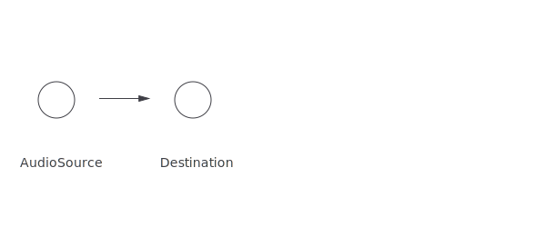

# Feeding the audio graph

In 2004, I was given an iPod.

I count this as one of the most intuitive pieces of technology I've ever owned.  It wasn't because of the the snazzy (colour!) menus or circular touchpad.  I loved how smoothly it fitted into my life. I could plug in my headphones and listen to music while I was walking around town.  Then when I got home, I could plug it into an amplifier and carry on listening there.

There was no faff. It didn't matter if I could find my favourite mix tape, or if my wifi was flakey - it was all just there.

Nowadays, when I'm trying to pair my phone with some bluetooth speakers, or can't find my usb-to-headphone jack, or even access any music because I don't have cellular reception; I really miss this simplicity.

### The Web Audio API

I think the Web Audio API feels kind of like my iPod did.

It's different from most browser APIs - rather than throwing around data, or updating dom elements - you plug together a graph of audio nodes, which the browser uses to generate/process/play sounds.

And the thing I like about it is that you can totally plug it into whatever you want, and it'll mostly just work.

So, let's get started. First of all we want an audio source.

```html
<audio src="night-owl.mp3" controls />
```

<section class="🔈" data-demo="plain">
  <audio src="night-owl.mp3" controls />
</section>

(Song - [Night Owl by Broke For Free](http://freemusicarchive.org/music/Broke_For_Free/Directionless_EP/Broke_For_Free_-_Directionless_EP_-_01_Night_Owl))


This totally works.

However, it's not using the Web Audio API, so we can't access or modify the sound it makes.

To hook this up to our audio graph, we can use an _AudioSourceNode_.  This captures the sound from the element, and lets us connect to other nodes in a graph.

<!-- It's kind of like plugging headphones into my iPod -->

```js
const audioCtx = new AudioContext()

const audio = document.querySelector('audio')
const input = audioCtx.createAudioSourceNode(audio)

input.connect(audioCtx.destination)
```

<section class="🔈" data-demo="basic">
  <audio src="night-owl.mp3" controls></audio>
</section>

Great. We've made something that looks and sounds *exactly* the same as it did before.

<!-- Though it's actually a bit awesome-er that that, now we're able to hook this up to other nodes. -->

<!--  -->

Go us.


## Gain

Let's plug in a _GainNode_ - this allows you to alter the amplitude (volume) of an an audio stream.

We can hook this node up to an `<input>` element by setting the gain property of the node.  (The syntax for this is kind of weird because it's an [AudioParam](https://developer.mozilla.org/en-US/docs/Web/API/AudioParam) which has options to set values at precise intervals).


```js
const node = audioCtx.createGain()

const input = document.querySelector('input')
input.oninput = () => node.gain.value = parseFloat(input.value)

input.connect(node)
node.connect(audioCtx.destination)
```

<section class="🔈" data-demo="gain">
  <audio src="night-owl.mp3" controls></audio>
  <input type="range" min="0" max="1" step="0.01" />
</section>

You can now see a range input, which can be dragged to update the state of our graph.

This input could be any kind of element, so now you'll be free to build the [volume control of your dreams](https://uxdesign.cc/the-worst-volume-control-ui-in-the-world-60713dc86950).

There's a number of nodes that let you modify/filter an audio stream in more interesting ways.  Head over to the [MDN Web Audio page](https://developer.mozilla.org/en-US/docs/Web/API/Web_Audio_API#Defining_audio_effects_filters) for a list of them.


<!--  -->


## Analysers

Something else we can add to our graph is an _AnalyserNode_.

This doesn't modify the audio at all, but allows us to inspect the sounds that are flowing through it.

We can put this into our graph between our _AudioSourceNode_ and the _GainNode_.

```js
const analyser = audioCtx.createAnalyser()

input.connect(analyser)
analyser.connect(gain)
gain.connect(audioCtx.destination)
```

<!--  -->

And now we have an analyser. We can access it from elsewhere to drive any kind of visuals.  For instance, if we wanted to draw lines on a canvas we could totally do that:

```js
const waveform = new Uint8Array(analyser.fftSize)
const frequencies = new Uint8Array(analyser.frequencyBinCount)
const ctx = canvas.getContext('2d')

const loop = () => {
    requestAnimationFrame(loop)
    analyser.getByteTimeDomainData(waveform)
    analyser.getByteFrequencyData(frequencies)

    ctx.beginPath()
    waveform.forEach((f, i) => ctx.lineTo(i, f))
    ctx.lineTo(0,255)
    frequencies.forEach((f, i) => ctx.lineTo(i, 255-f))
    ctx.stroke()
}
loop()
```

<section class="🔈" data-demo="analyser">
  <audio src="night-owl.mp3" controls></audio>
  <input type="range" min="0" max="1" step="0.01" />
  <canvas width="700" height="300"></canvas>
</section>


You can see that we have two arrays of data available (I added colours for clarity):

1. The waveform - the raw samples of the audio being played.
2. The frequencies - a [fourier transform](https://giphy.com/gifs/Km4XeiMqFNCDK/html5) of the audio passing through the node.

What's cool about this is that you're not tied to any specific functionality of the Web Audio API.  If it's possible for you to update something with an array of numbers, then you can just apply it to the output of the analyser node.

For instance, if we _wanted to_, we could definitely animate a list of emoji in time with our music.

```js
spans.forEach(
  (s, i) => s.style.transform = `scale(${1 + (frequencies[i]/100)})`
)
```

<section class="🔈" data-demo="emoji">
  <audio src="night-owl.mp3" controls></audio>
  <input type="range" min="0" max="1" step="0.01" />
  <div class="emoji">
    <span>🔈</span><span>🎤</span><span>🎤</span><span>🎤</span><span>🎺</span><span>🎷</span><span>📯</span><span>🎶</span><span>🔊</span><span>🎸</span><span>🎺</span><span>🎤</span><span>🎸</span><span>🎼</span><span>🎷</span><span>🎺</span><span>🎻</span><span>🎸</span><span>🎻</span><span>🎺</span><span>🎸</span><span>🎶</span><span>🥁</span><span>🎶</span><span>🎵</span><span>🎵</span><span>🎷</span><span>📯</span><span>🎸</span><span>🎹</span><span>🎤</span><span>🎷</span><span>🎻</span><span>🎷</span><span>🔈</span><span>🔊</span><span>📯</span><span>🎼</span><span>🎤</span><span>🎵</span><span>🎼</span><span>📯</span><span>🥁</span><span>🎻</span><span>🎻</span><span>🎤</span><span>🔉</span><span>🎵</span><span>🎹</span><span>🎸</span><span>🎷</span><span>🔉</span><span>🔈</span><span>🔉</span><span>🎷</span><span>🎶</span><span>🔈</span><span>🎸</span><span>🎸</span><span>🎻</span><span>🎤</span><span>🥁</span><span>🎼</span><span>📯</span><span>🎸</span><span>🎸</span><span>🎼</span><span>🎸</span><span>🥁</span><span>🎼</span><span>🎶</span><span>🎶</span><span>🥁</span><span>🎤</span><span>🔊</span><span>🎷</span><span>🔊</span><span>🔈</span><span>🎺</span><span>🔊</span><span>🎻</span><span>🎵</span><span>🎻</span><span>🎸</span><span>🎵</span><span>🎺</span><span>🎤</span><span>🎷</span><span>🎸</span><span>🎶</span><span>🎼</span><span>📯</span><span>🔈</span><span>🎺</span><span>🎤</span><span>🎵</span><span>🎸</span><span>🎸</span><span>🔊</span><span>🎶</span><span>🎤</span><span>🥁</span><span>🎵</span><span>🎹</span><span>🎸</span><span>🔈</span><span>🎻</span><span>🔉</span><span>🥁</span><span>🔉</span><span>🎺</span><span>🔊</span><span>🎹</span><span>🥁</span><span>🎷</span><span>📯</span><span>🎷</span><span>🎷</span><span>🎤</span><span>🎸</span><span>🔉</span><span>🎹</span><span>🎷</span><span>🎸</span><span>🎺</span><span>🎼</span><span>🎤</span><span>🎼</span><span>🎶</span><span>🎷</span><span>🎤</span><span>🎷</span><span>📯</span><span>📯</span><span>🎻</span><span>🎤</span><span>🎷</span><span>📯</span><span>🎹</span><span>🔈</span><span>🎵</span><span>🎹</span><span>🎼</span><span>🔊</span><span>🔉</span><span>🔉</span><span>🔈</span><span>🎶</span><span>🎸</span><span>🥁</span><span>🎺</span><span>🔈</span><span>🎷</span><span>🎵</span><span>🔉</span><span>🥁</span><span>🎷</span><span>🎹</span><span>🎷</span><span>🔊</span><span>🎤</span><span>🎤</span><span>🔊</span><span>🎤</span><span>🎤</span><span>🎹</span><span>🎸</span><span>🎹</span><span>🔉</span><span>🎷</span>
  </div>
</section>

### Generating Audio

So far, we've been using the `<audio>` element as a source of sound.

There's [a few](https://developer.mozilla.org/en-US/docs/Web/API/Web_Audio_API#Defining_audio_sources) other sources of audio that we can use.  We'll look at the _AudioBufferNode_ - which allows you to manually generate a sound sample, and then connect it to our graph.

First we have to create an _AudioBuffer_, which holds our raw data, then we pass that to an _AudioBufferNode_ which we can then treat just like our _AudioSource_ node.

This can get a bit boring, so we'll use a helper method that makes it simpler to generate sounds.

```js
const generator = (audioCtx, target) => (seconds, fn) => {
  const { sampleRate } = audioCtx

  const buffer = audioCtx.createBuffer(
      1, sampleRate * seconds, sampleRate
  )
  const data = buffer.getChannelData(0)

  for (var i = 0; i < data.length; i++) {
    data[i] = fn(i / sampleRate, seconds)
  }

  return () => {
    const source = audioCtx.createBufferSource()
    source.buffer = audioBuffer

    source.connect(target || audioCtx.destination)
    source.start()  
  }
}

const sound = generator(audioCtx, gain)
```

Our wrapper will let us provide a function that maps time (in seconds) to a sample (between 1 and -1). This generates a waveform, like we saw before with the analyser node.

For example, the following will generate 0.75 seconds of white noise at 20% volume.

```js
const noise = sound(0.75, t => Math.random() * 0.2)

button.onclick = noise
```

<section class="🔈" data-demo="buttonNoise">
  <div>
    <button>Noise</button>
  </div>
  <input type="range" min="0" max="1" step="0.01" />
  <canvas width="700" height="300"></canvas>
</section>

Now we've got a noisy button! Handy.

Rather than having a static set of audio nodes, each time we click the button, we add a new node to our graph. Although this feels inefficient, it's not actually too bad - the browser can do a good job of cleaning up old nodes once they've played.

<!-- / [buffer]   (source) => (analyser) => (gain) => (output) -->

An interesting property of defining sounds as functions is that we can combine multiple function to generate new sounds.

So if we wanted to fade our noise in & out, we could write a higher order function that does that.


```js
const ease = fn => (t, s) =>
  fn(t) * Math.sin((t / s) * Math.PI)

const noise = sound(0.75, ease(t => Math.random() * 0.2))
```
<section class="🔈" data-demo="buttonEase">
  <div>
    <button>ease(noise)</button>
  </div>
  <input type="range" min="0" max="1" step="0.01" />
  <canvas width="700" height="300"></canvas>
</section>

And we can do more than just white noise - if we use `Math.sin`, we can generate some nice pure tones.

```js
// Math.sin with period of 0..1
const wave = v => Math.sin(Math.PI * 2 * v)
const hz = f => t => wave(t * f)

const _440hz = sound(0.75, ease(hz(440)))
const _880hz = sound(0.75, ease(hz(880)))
```

<section class="🔈" data-demo="buttonHz">
  <div>
    <button data-hz="440">440Hz</button>
    <button data-hz="880">880Hz</button>
  </div>
  <input type="range" min="0" max="1" step="0.01" />
  <canvas width="700" height="300"></canvas>
</section>

We can also make our functions more complex. Below we're combining several frequencies to make a richer sounding tone.

```js
const harmony = f => [4, 3, 2, 1].reduce(
    (v, h, i) => (sin(f * h) * (i+1) ) + v
)

const a440 = sound(0.75, ease(harmony(440)))
```

<section class="🔈" data-demo="buttonHarmony">
  <div>
    <button data-hz="440">440Hz</button>
    <button data-hz="880">880Hz</button>
  </div>
  <input type="range" min="0" max="1" step="0.01" />
  <canvas width="700" height="300"></canvas>
</section>

Cool.

We're still not using any audio-specific functionality, so we can repurpose anything that does an operation on data.

For example, we can use [d3.js](https://d3js.org/) - usually used for interactive data visualisations - to generate a triangular waveform.

```js
const triangle = d3.scaleLinear()
    .domain([0, .5,  1])
    .range([-1,  1, -1])

const wave = t => triangle(t % 1)

const a440 = sound(0.75, ease(harmony(440)))
```

<section class="🔈" data-demo="buttonD3">
  <div>
    <button data-hz="440">440Hz</button>
    <button data-hz="880">880Hz</button>
  </div>
  <input type="range" min="0" max="1" step="0.01" />
  <canvas width="700" height="300"></canvas>
</section>

… It's pretty interesting to play around with different functions.  I've plonked everything in [jsbin](https://jsbin.com/tawenuh/edit?js,output) if you want to have a play yourself.


### A departure from best practice

We've been generating our audio from scratch, but most of what we've looked at can be implemented by a series of native Web Audio nodes.

<!-- (oscillator) -> (gain) -> (destination) -->

This would be way performant (because it's not happening on the main thread), and more flexible in some ways (because you can set timings dynamically whilst the note is playing).

But we're going to stay with this approach because it's fun, and sometimes the fun thing to do might not technically be the best thing to do.


### Making a keyboard

Having a button that makes a sound is totally great, but how about lots of buttons that make lots of sounds?  Yup, totally greater-er.

The first thing we need to know is the frequency of each note.

I thought this would be awkward because pianos were invented more than 250 years before the Hz unit was defined, so surely there wouldn't be a simple mapping between the two?

```js
const freq = note => 27.5 * Math.pow(2, (note - 21) / 12)
```

This equation blows my mind; I'd never really figured how tightly music and maths fit together.  When you see a chord or melody, you can directly map it back to a mathematical pattern.

So, our keyboard is actually an SVG picture of a keyboard, so we can traverse the elements of it and map each element to a sound generated by one of the functions that we came up with before.

```js
Array.from(svg.querySelector('rect'))
  .sort((a, b) => + a.x - b.x)
  .forEach((key, i) =>
    key.addEventListener('touchstart',
      sound(0.75, ease(harmony(freq(i + 48))))
    )
  )
```

<section class="🔈" data-demo="keyboard">
  <svg viewBox="0 0 600 250" width="600" height="250" xmlns="http://www.w3.org/2000/svg"><g fill="none" fill-rule="evenodd"><rect class="key" fill="#FFF" x="33" y="65" width="35" height="121" rx="4"/><rect class="key" fill="#FFF" x="71.538" y="65" width="35" height="121" rx="4"/><rect class="key" fill="#FFF" x="110.077" y="65" width="35" height="121" rx="4"/><rect class="key" fill="#FFF" x="148.615" y="65" width="35" height="121" rx="4"/><rect class="key" fill="#FFF" x="187.154" y="65" width="35" height="121" rx="4"/><rect class="key" fill="#FFF" x="225.692" y="65" width="35" height="121" rx="4"/><rect class="key" fill="#FFF" x="264.231" y="65" width="35" height="121" rx="4"/><rect class="key" fill="#FFF" x="302.769" y="65" width="35" height="121" rx="4"/><rect class="key" fill="#FFF" x="341.308" y="65" width="35" height="121" rx="4"/><rect class="key" fill="#FFF" x="379.846" y="65" width="35" height="121" rx="4"/><rect class="key" fill="#FFF" x="418.385" y="65" width="35" height="121" rx="4"/><rect class="key" fill="#FFF" x="456.923" y="65" width="35" height="121" rx="4"/><rect class="key" fill="#FFF" x="495.462" y="65" width="35" height="121" rx="4"/><rect class="key" fill="#FFF" x="534" y="65" width="35" height="121" rx="4"/><rect class="key" fill="#383838" x="60" y="59" width="20" height="65" rx="4"/><rect class="key" fill="#383838" x="99" y="59" width="20" height="65" rx="4"/><rect class="key" fill="#383838" x="176" y="59" width="20" height="65" rx="4"/><rect class="key" fill="#383838" x="214" y="59" width="20" height="65" rx="4"/><rect class="key" fill="#383838" x="253" y="59" width="20" height="65" rx="4"/><rect class="key" fill="#383838" x="330" y="59" width="20" height="65" rx="4"/><rect class="key" fill="#383838" x="368" y="59" width="20" height="65" rx="4"/><rect class="key" fill="#383838" x="445" y="59" width="20" height="65" rx="4"/><rect class="key" fill="#383838" x="484" y="59" width="20" height="65" rx="4"/><rect class="key" fill="#383838" x="522" y="59" width="20" height="65" rx="4"/></g></svg>

  <canvas width="700" height="300"></canvas>
  <style>
    rect {stroke: #ddd;}
    rect:hover {opacity: 0.8; stroke: #000}
  </style>
</section>

Et voilà. We have a keyboard.

What I like about this is that it's completely pure - there's no lookup tables or hardcoded attributes; we've just defined a mapping from SVG elements to the sound they should probably make.

<!-- Something that's kind of fun about this is that we can apply our code to any SVG at all and make a keyboard out of it. -->

### Doing better in the future

As I mentioned before, this could be implemented more performantly with Web Audio nodes, or even better - use something like [Tone.js](https://tonejs.github.io/) to be performant for you.

Web Audio has been around for awhile, though we're getting new challenges with immersive WebXR experiences, where [spatial audio](https://googlechrome.github.io/omnitone/#home) becomes really important.

There's also always support & api improvements (if you like _AudioBufferNode_, you're going to *love* [_AudioWorklet_](https://webaudio.github.io/web-audio-api/#AudioWorklet))

### Conclusion

And that's about it.

Web Audio isn't some black box, you can easily link it with whatever framework, or UI that you've built (whether you should is an entirely different question).

And if anyone ever asks you "could you turn this SVG into a musical instrument?" you don't have to stare blankly at them anymore.


---

Ben Foxall is a JavaScript Engineer and Adventurist. After 16 years of avoiding the subject; he'd like to tell Jamie that he probably did lose that mix-tape - he's sorry about, but also, he's not sure it was as good as Jamie made out.  Oh and also, Chris, sorry for breaking your phone, and that I still laugh every time I think about it.
